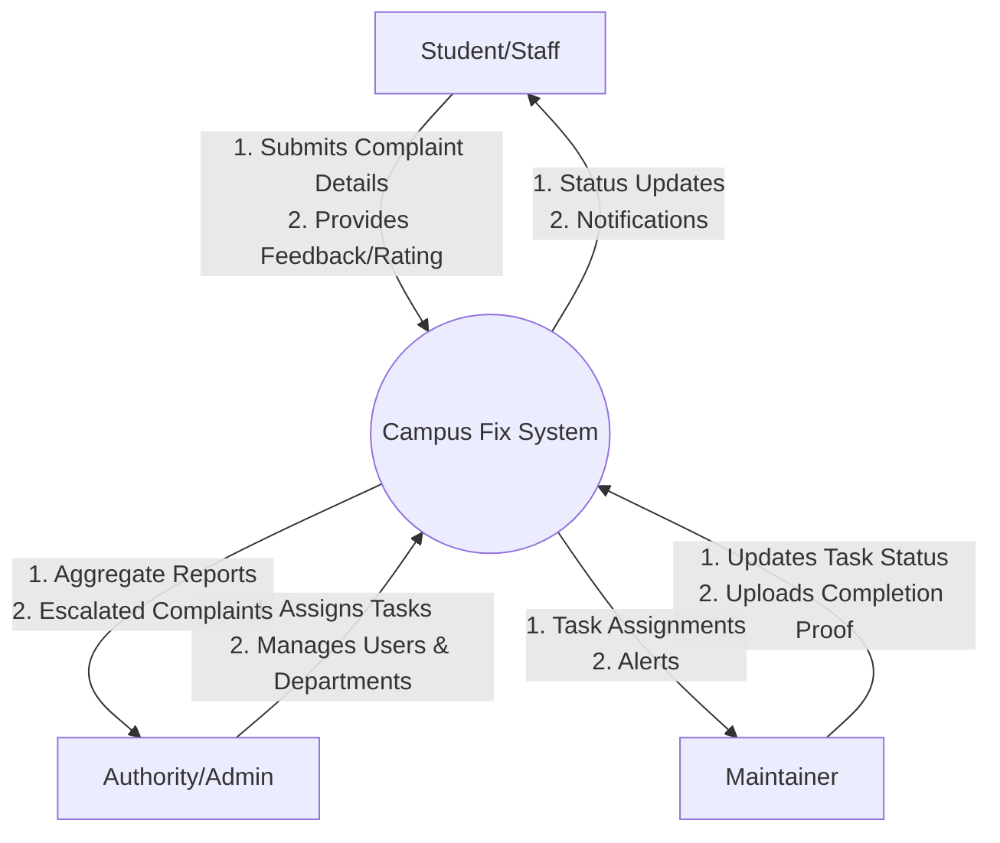
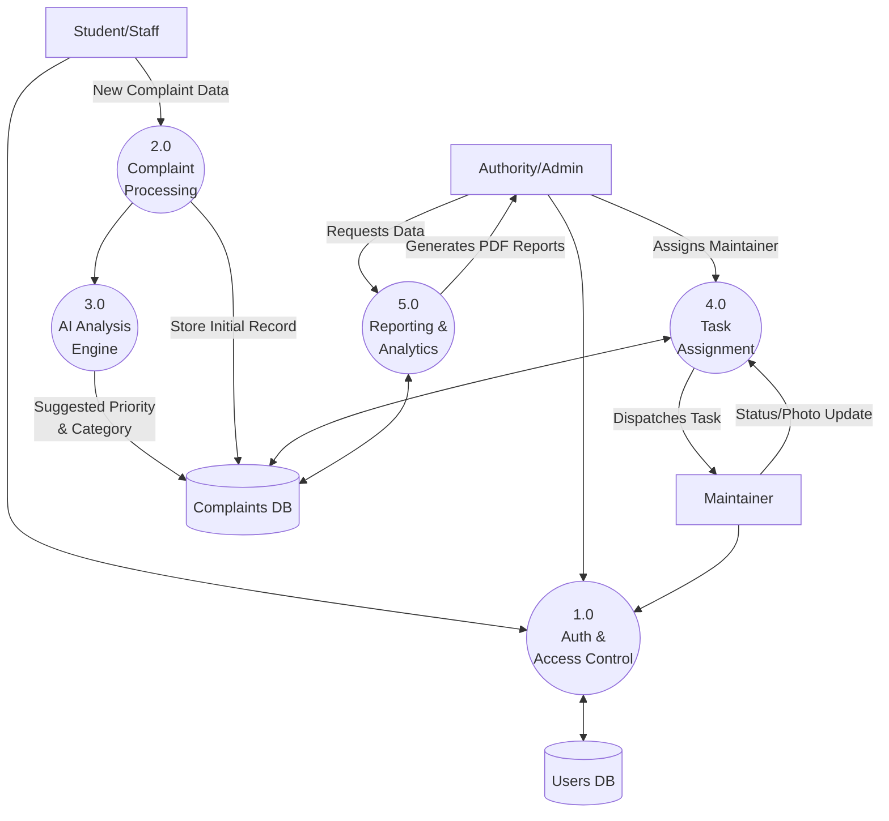
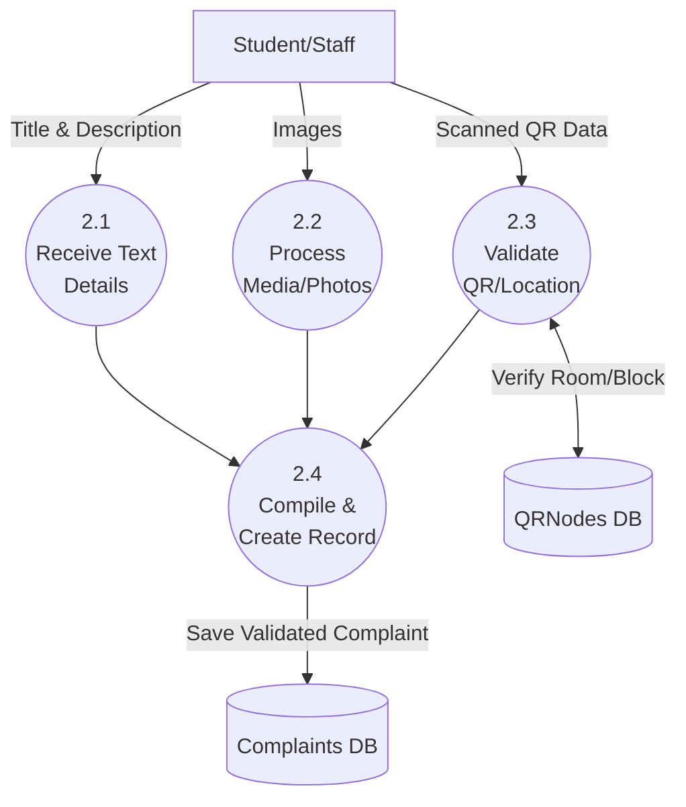
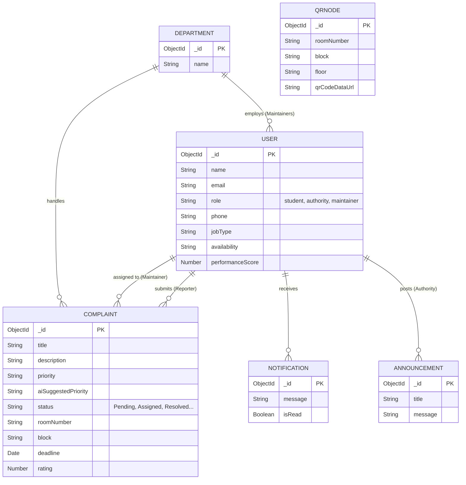

# Campus Fix: Project Documentation

## 1. Abstract
**Campus Fix** is a comprehensive, centralized complaint management system tailored for educational institutions to streamline the reporting, assignment, and resolution of infrastructure and maintenance issues. The system serves three main stakeholders: **Students/Staff** (who report issues), **Maintainers** (who resolve them), and **Authorities** (who manage and oversee the process). 

The platform leverages **Artificial Intelligence** to automatically analyze complaint descriptions and suggest priority levels, categories, and estimated fix times, significantly improving administrative efficiency and response times. Additional features include QR node tracking for location-specific reporting (enabling students to simply scan a QR code in a room to report an issue), automated PDF report generation, and real-time notifications to keep all stakeholders informed throughout the complaint lifecycle.

---

## 2. Architecture
The project follows a modern client-server architecture using the **MERN** stack along with a cross-platform mobile application.

- **Frontend (Web):** Built with **React.js**. It serves as the primary dashboard for Authorities to manage complaints, view analytics, and assign tasks. It also provides a web portal for Students to log complaints.
- **Frontend (Mobile):** Built with **React Native**. It serves as the primary interface for Maintainers (to accept tasks, update statuses, and upload completion photos) and Students on the go.
- **Backend:** Built with **Node.js** and **Express.js**. It provides RESTful APIs for the frontends, handles authentication, and integrates with third-party services.
- **Database:** **MongoDB** (accessed via Mongoose). A NoSQL database that stores user profiles, complaint records, department structures, notifications, and QR node metadata.
- **AI Integration:** Uses AI models to parse text inputs and intelligently assign priorities and categories.
- **File Storage:** Handles image uploads for complaint proofs and resolution photos.
- **Reporting:** Utilizes PDF generation libraries to export analytics and complaint reports.

---

## 3. Working Mechanism
1. **Reporting an Issue:** A student or staff member scans a QR code located in a specific room (or manually selects the location). They fill out a form detailing the issue (e.g., broken projector, plumbing leak) and upload supporting photos.
2. **AI Analysis:** The backend receives the submission and passes the description to the AI module. The AI evaluates the severity and suggests a category (e.g., 'Infrastructure', 'Lab Management') and priority ('Low', 'Medium', 'High', 'Urgent').
3. **Task Assignment:** 
   - *Manual:* An Authority reviews the new complaint on their dashboard and assigns it to an available Maintainer based on their job type (e.g., Electrician, Plumber).
   - *Automated:* The system can route the complaint directly to the relevant department based on the AI's categorization.
4. **Task Execution:** The assigned Maintainer receives a real-time notification on their mobile app. They can "Accept" the task, change the status to "In Progress," and upon completion, take a photo of the fixed issue and mark it as "Resolved."
5. **Closure & Feedback:** The original reporter is notified that the issue has been resolved. They can then verify the fix, leave a rating, and provide feedback. Authorities can monitor maintainer performance and system efficiency via the analytics dashboard.

---

## 4. Data Flow Diagrams (DFD)

### Level 0 DFD (Context Diagram)
The Level 0 DFD shows the system as a single high-level process interacting with external entities.

### Level 1 DFD
The Level 1 DFD breaks down the main system into primary sub-processes.

### Level 2 DFD (Focus: Process 2.0 Complaint Processing)
The Level 2 DFD details the steps involved purely in receiving and processing a new complaint.

---

## 5. Entity-Relationship (ER) Diagram
The ER Diagram outlines the database schema and the relationships between the core entities.

---
*Note: This documentation reflects the current state of the Campus Fix application schema and functional workflow based on the backend models and routing architecture.*
